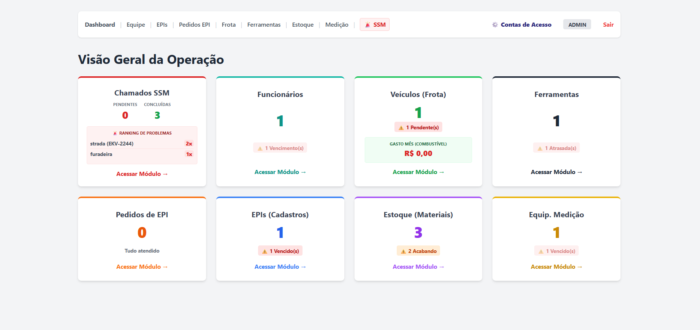
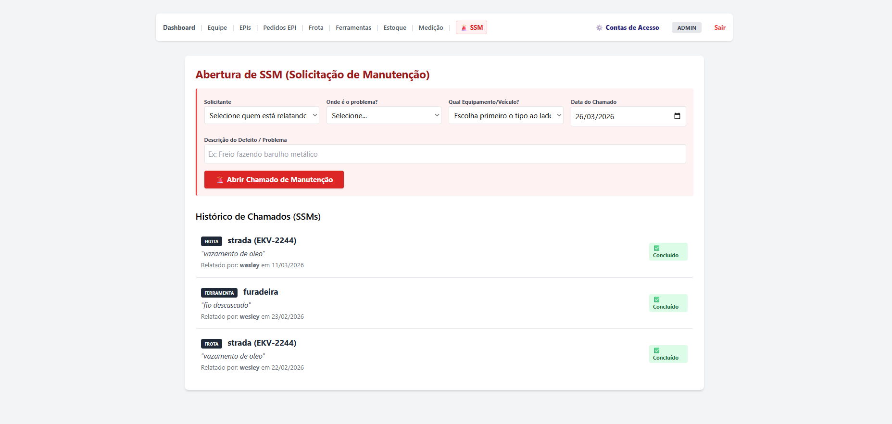

# 🏭 Sistema de Gestão de Recursos (ERP) - Operações & GLP


Um sistema completo de Gestão de Recursos (ERP) desenvolvido para resolver os gargalos reais do controle operacional em ambientes industriais, projetos de GLP e engenharia de campo. 

O sistema integra a gestão do capital humano com a conformidade de segurança (Normas Regulamentadoras), controle de ativos físicos (frotas e ferramentas) e manutenção produtiva total (SSM).

## 💡 A Motivação do Projeto

Este projeto nasceu da necessidade de unir a visão estratégica da Liderança de Projetos com o Desenvolvimento de Sistemas. Em operações de campo e engenharia (como redes de GLP), a falta de rastreabilidade de manutenções, o controle manual de certificações de segurança (NRs) e a má gestão de ativos geram riscos operacionais e financeiros. 

O objetivo deste ERP é centralizar, automatizar e gerar inteligência de dados sobre toda a infraestrutura física e humana da operação, garantindo conformidade em auditorias e agilidade na tomada de decisão.

## 🚀 Módulos e Funcionalidades

### 👥 Gestão de Pessoas & Segurança do Trabalho (SST)
* **Controle de Colaboradores:** Cadastro completo com matrículas e histórico de admissão.
* **Auditoria de NRs e ASO:** Monitoramento automático de vencimentos de certificações críticas (ASO, Ficha de EPI, NR-12, NR-13 e NR-35) com alertas visuais preventivos.
* **Gestão de EPIs:** Cadastro de Equipamentos de Proteção Individual, controle de validade do C.A. (Certificado de Aprovação) e fluxo de aprovação de pedidos de compras de EPI solicitados por operadores.

### ⚙️ Manutenção e Ativos Físicos (TPM)
* **Gestão de Frotas:** Controle de veículos, quilometragem, alertas preditivos de manutenção (preventiva/corretiva) e histórico financeiro de abastecimentos.
* **Ferramentas de Campo:** Inventário de maquinário com cronograma de revisões obrigatórias.
* **Equipamentos de Medição:** Controle rigoroso de instrumentos calibráveis (ex: manômetros, detectores de gás) com retenção de histórico de calibrações e alertas de *due date*.
* **Portal SSM (Solicitação de Serviço de Manutenção):** Módulo onde colaboradores relatam falhas em frotas ou ferramentas. Inclui painel de *ranking* dos ativos mais defeituosos no Dashboard gerencial.

### 📦 Supply Chain
* **Controle de Estoque:** Gestão de entradas e saídas de materiais (ex: tubulações, conexões) com registro automático de qual colaborador realizou a retirada (rastreabilidade total). Alertas automáticos para estoque em baixa.

## 🏗️ Arquitetura e Tecnologias

O sistema segue o padrão de **REST API** para o Back-end, servindo *templates* HTML dinâmicos para o Front-end.

* **Back-end:** Python, FastAPI (alta performance e validação assíncrona).
* **Banco de Dados:** SQLite integrado via **SQLAlchemy** (Object-Relational Mapping), garantindo segurança contra SQL Injection e facilidade de migração para PostgreSQL/MySQL no futuro.
* **Segurança:** Autenticação via JWT (JSON Web Tokens) e *hash* de senhas utilizando `passlib[bcrypt]`.
* **Controle de Acesso (RBAC):** Níveis de permissão estritos entre `Admin` (Controle total e acesso ao painel de configurações de segurança) e `Operador` (Lançamentos diários e visualização).
* **Front-end:** HTML5, JavaScript (Vanilla com Fetch API) e **Tailwind CSS** para um design responsivo, limpo e voltado para a experiência do usuário (UX).

## 📸 Telas do Sistema




## ⚙️ Como executar localmente

1. Clone este repositório:
```bash
git clone [https://github.com/SEU_USUARIO/SEU_REPOSITORIO.git](https://github.com/SEU_USUARIO/SEU_REPOSITORIO.git)
cd SEU_REPOSITORIO
```

2. Crie um ambiente virtual (Opcional, mas recomendado):
```bash
python -m venv venv
# No Windows:
venv\Scripts\activate
# No Linux/Mac:
source venv/bin/activate
```

3. Instale as dependências:
```bash
pip install -r requirements.txt
```

4. Crie o usuário Administrador padrão:
```bash
python criar_usuarios.py
```

5. Inicie o servidor em ambiente de desenvolvimento:
```bash
uvicorn main:app --reload
```

6. Acesse no navegador: `http://localhost:8000` (Login inicial: `admin` | Senha: `admin123`)

---
**Autor:** Esthevam Alvico  
*Desenvolvido como solução prática para otimização de rotinas de Engenharia de Projetos e TI.*